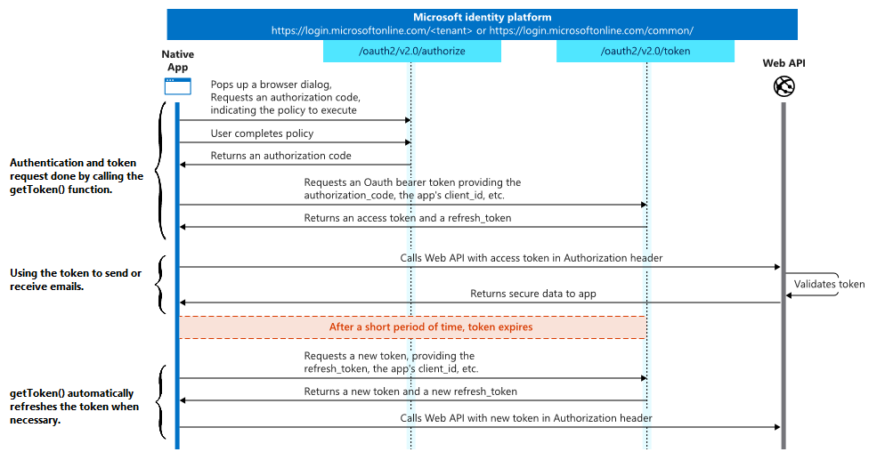

# OAuth2Provider Class

## Overview

The `OAuth2Provider` class allows you to request authentication tokens to third-party web services providers in order to use their APIs in your application. This is done in two steps:

1. Using the `New OAuth2 provider` component method, you instantiate an object of the `OAuth2Provider` class that holds authentication information.
2. You call the `OAuth2ProviderObject.getToken()` class function to retrieve a token from the web service provider.

Here's a diagram of the authorization process:

This class can be instantiated in two ways:
* by calling the `New OAuth2 provider` method
* by calling the `cs.NetKit.OAuth2Provider.new()` function

**Warning:** OAuth2 authentication in `signedIn` mode requires a browser. Since some servers have restrictions regarding the supported browsers (for example, check this [Google support](https://support.google.com/accounts/answer/7675428?hl=en) page), the functionality may not work properly.

**Warning:** Shared objects are not supported by the 4D NetKit API.

## Table of contents

- [New OAuth2 provider](#new-oauth2-provider)
- [OAuth2ProviderObject.getToken()](#oauth2providerobjectgettoken)

## **New OAuth2 provider**

The [`New OAuth2 provider`](../Methods/New%20OAuth2%20provider.md) method instantiates an object of the `OAuth2Provider` class that holds authentication information.

For a full description of the method, its parameters, the available properties of `paramObj`, the returned object and examples, please refer to the [`New OAuth2 provider`](../Methods/New%20OAuth2%20provider.md) method page.

## OAuth2ProviderObject.getToken()

**OAuth2ProviderObject.getToken()** : Object

|Parameter|Type||Description|
|---------|--- |------|------|
|Result|Object|<-| Object that holds information on the token retrieved

### Description

`.getToken()` returns an object that contains a `token` property (as defined by the [IETF](https://datatracker.ietf.org/doc/html/rfc6749#section-5.1)), as well as optional additional information returned by the server:

Property|Object properties|Type|Description |
|--- |---------| --- |------|
|token||Object| Token returned |
|| expires_in | Text | How long the access token is valid (in seconds). |
|| access_token |Text | The requested access token. |
|| refresh_token | Text | Your app can use this token to acquire additional access tokens after the current access token expires. Refresh tokens are long-lived, and can be used to retain access to resources for extended periods of time. Available only if the value of the `permission` property is "signedIn". |
|| token_type | Text | Indicates the token type value. The only token type that Azure AD supports is "Bearer". |
||id_token|text|`id_token` value associated with the authenticated session. Present only for *openID* requests.|
||scope|Text| A space separated list of permissions that the access_token is valid for.|
|tokenExpiration || Text | Timestamp (ISO 8601 UTC) that indicates the expiration time of the token|

If the value of `token` is empty, the command sends a request for a new token.

If the token has expired:
*   If the token object has the `refresh_token` property, the command sends a new request to refresh the token and returns it.
*   If the token object does not have the `refresh_token` property, the command automatically sends a request for a new token.

When requesting access on behalf of a user ("signedIn" mode) the command opens a web browser to request authorization.

In "signedIn" mode, when `.getToken()` is called, a web server included in 4D NetKit starts automatically on the port specified in the [redirectURI parameter](#description) to intercept the provider's authorization response and display it in the browser.

## See also

[Google Class](./Google.md) 
[Office365 Class](./Office365.md) 
[Secure OpenID Authentication with nonce attribute (blog post)](https://blog.4d.com/4d-netkit-secure-openid-authentication-with-nonce-attribute)
