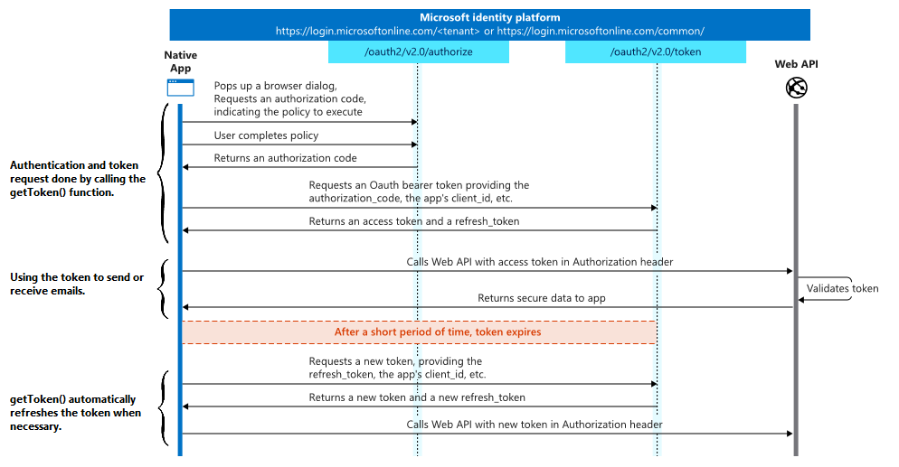

# 4D NetKit

## Overview

4D NetKit is a built-in 4D component that allows you to interact with third-party web services and their APIs, such as [Microsoft Graph](https://docs.microsoft.com/en-us/graph/overview).

## Table of contents

* [OAuth2Provider class](#oauth2provider)
	- [New OAuth2 provider](#new-oauth2-provider)
	- [OAuth2ProviderObject.getToken()](#oauth2providerobjectgettoken)
* [Office365 class](#office365)
	- [New Office365 provider](#new-office365-provider)
	- [Office365.mail.append()](#office365mailappend)
	- [Office365.mail.copy()](#office365mailcopy)
	- [Office365.mail.createFolder()](#office365mailcreatefolder)
	- [Office365.mail.delete()](#office365maildelete)
	- [Office365.mail.deleteFolder()](#office365maildeletefolder)
	- [Office365.mail.getFolder()](#office365mailgetfolder)
	- [Office365.mail.getFolderList()](#office365mailgetfolderlist)
	- [Office365.mail.getMail()](#office365mailgetmail)
	- [Office365.mail.getMails()](#office365mailgetmails)
	- [Office365.mail.move()](#office365mailmove)
	- [Office365.mail.renameFolder()](#office365mailrenameFolder)
	- [Office365.mail.reply()](#office365mailreply)
	- [Office365.mail.send()](#office365mailsend)
	- [Office365.mail.update()](#office365mailupdate)
	- [Well-known folder names](well-known-folder-names)
	- ["Microsoft" mail object properties](#microsoft-mail-object-properties)
	- [Status object (Office365 Class)](#status-object)
	- [Office365.user.get()](#office365userget)
	- [Office365.user.getCurrent()](#office365usergetcurrent)
	- [Office365.user.list()](#office365userlist)
* [Google class](#google)
	- [cs.NetKit.Google.new()](#csnetkitgooglenew)
	- [Google.mail.append()](#googlemailappend)
	- [Google.mail.createLabel()](#googlemailcreatelabel)
	- [Google.mail.delete()](#googlemaildelete)
	- [Google.mail.deleteLabel()](#googlemaildeletelabel)
	- [Google.mail.getLabel()](#googlemailgetlabel)
	- [Google.mail.getLabelList()](#googlemailgetlabellist)
	- [Google.mail.getMail()](#googlemailgetmail)
	- [Google.mail.getMailIds()](#googlemailgetmailids)
	- [Google.mail.getMails()](#googlemailgetmails)
	- [Google.mail.send()](#googlemailsend)
	- [Google.mail.untrash()](#googlemailuntrash)
	- [Google.mail.update()](#googlemailupdate)
	- [Google.mail.updateLabel()](#googlemailupdatelabel)
	- [labelInfo object](#labelinfo-object)
	- [Status object (Google Class)](#status-object-google-class)

* [Tutorial : Authenticate to the Microsoft Graph API in service mode](#authenticate-to-the-microsoft-graph-api-in-service-mode)
* (Archived) [Tutorial : Authenticate to the Microsoft Graph API in signedIn mode (4D NetKit), then send an email (SMTP Transporter class)](#authenticate-to-the-microsoft-graph-api-in-signedin-mode-and-send-an-email-with-smtp)
* [Copyrights](#copyrights)


**Warning:** Shared objects are not supported by the 4D NetKit API.


## OAuth2Provider

The `OAuth2Provider` class allows you to request authentication tokens to third-party web services providers in order to use their APIs in your application. This is done in two steps:

1. Using the `New OAuth2 provider` component method, you instantiate an object of the `OAuth2Provider` class that holds authentication information.
2. You call the `OAuth2ProviderObject.getToken()` class function to retrieve a token from the web service provider.

Here's a diagram of the authorization process:


This class can be instantiated in two ways:
* by calling the `New OAuth2 provider` method
* by calling the `cs.NetKit.OAuth2Provider.new()` function


**Warning:** OAuth2 authentication in `signedIn` mode requires a browser. Since some servers have restrictions regarding the supported browsers (for example, check this [Google support](https://support.google.com/accounts/answer/7675428?hl=en) page), the functionality may not work properly.

### **New OAuth2 provider**

**New OAuth2 provider**( *paramObj* : Object ) : cs.NetKit.OAuth2Provider

#### Parameters
|Parameter|Type||Description|
|---------|--- |:---:|------|
|paramObj|Object|->| Determines the properties of the object to be returned |
|Result|cs.NetKit.OAuth2Provider|<-| Object of the OAuth2Provider class

#### Description

`New OAuth2 provider` instantiates an object of the `OAuth2Provider` class.

In `paramObj`, pass an object that contains authentication information.


The available properties of `paramObj` are:

|Parameter|Type|Description|Optional|
|---------|--- |------|------|
| name | text | Name of the provider. Available values: "Microsoft", "Google" or "" (if "" or undefined/null attribute, the authenticateURI and the tokenURI need to be filled by the 4D developer).|Yes
| permission | text | <ul><li> "signedIn": Azure AD/Google will sign in the user and ensure they gave their consent for the permissions your app requests (opens a web browser).</li><li>"service": the app calls [Microsoft Graph with its own identity](https://docs.microsoft.com/en-us/graph/auth-v2-service)/Google (access without a user).</li></ul>|No
| clientId | text | The client ID assigned to the app by the registration portal.|No
| redirectURI | text | (Not used in service mode) The redirect_uri of your app, the location where the authorization server sends the user once the app has been successfully authorized. When you call the `.getToken()` class function, a web server included in 4D NetKit is started on the port specified in this parameter to intercept the provider's authorization response.|No in signedIn mode, Yes in service mode
| scope | text or collection | Text: A space-separated list of the Microsoft Graph permissions that you want the user to consent to.</br> Collection: Collection of Microsoft Graph permissions. |Yes
| tenant | text | Microsoft: The {tenant} value in the path of the request can be used to control who can sign into the application. The allowed values are: <ul><li>"common" for both Microsoft accounts and work or school accounts (default value)</li><li>"organizations" for work or school accounts only </li><li>"consumers" for Microsoft accounts only</li><li>tenant identifiers such as tenant ID or domain name.</li></ul>Google (service mode only): Email address to be considered as the email address of the user for which the application is requesting delegated access. |Yes
| authenticateURI | text | Uri used to do the Authorization request.<br/> Default for Microsoft: "https://login.microsoftonline.com/{tenant}/oauth2/v2.0/authorize".<br/> Default for Google: "https://accounts.google.com/o/oauth2/auth". |Yes
| tokenURI | text | Uri used to request an access token.<br/> Default for Microsoft: "https://login.microsoftonline.com/{tenant}/oauth2/v2.0/token".<br/> Default for Google: "https://accounts.google.com/o/oauth2/token".|Yes
|tokenExpiration | text | Timestamp (ISO 8601 UTC) that indicates the expiration time of the token.| Yes
| clientSecret | text | The application secret that you created for your app in the app registration portal. Required for web apps. |Yes
| token | object | If this property exists, the `getToken()` function uses this token object to calculate which request must be sent. It is automatically updated with the token received by the `getToken()` function.   |Yes
| timeout|real| Waiting time in seconds (by default 120s).|Yes
|    prompt   | text |(Optional) A space-delimited, case-sensitive list of prompts to present the user.<br /><br/>Possible values are:<br/><ul><li>none: Do not display any authentication or consent screens. Must not be specified with other values.</li><li>consent: Prompt the user for consent.</li><li>select_account: Prompt the user to select an account.</li></ul>(if you don't specify this parameter, the user will be prompted only the first time your project requests access. )|Yes|
|  loginHint  | text | (Optional) This option can be used to inform the Google Authentication Server which user is attempting to authenticate if your application is aware of this information. By prefilling the email field in the sign-in form or by selecting the appropriate multi-login session, the server uses the hint to simplify the login flow either.<br/> Set the parameter value to a sub-identifier or email address that corresponds to the user's Google ID.                                                                                       |Yes|
|  accessType | text | (Recommended) Indicates whether your application can refresh access tokens when the user is not present at the browser.<br/> Valid parameter values are online (default) and offline.<br/> Set the value to offline if your application needs to update access tokens when the user is not present at the browser. This is how access tokens are refreshed. This value instructs the Google authorization server to return a refresh token and an access token the first time that your application exchanges an authorization code for tokens. |Yes|
| clientEmail | text | (mandatory, Google / service mode only)  email address of the service account used                                                                                                                                                                                                                                                                                                                                                                                                                                                            |No|
| privateKey  | text | (Google / service mode only)  Private key given by Google. Mandatory if .permission="service" and .name="Google"                                                                                                                                                                                                                                                                                                                                                                                                                            |No|
| authenticationPage|text or file object|Path of the web page to display in the web browser when the authentication code is received correctly in signed in mode (If not present the default page is used).|Yes
| authenticationErrorPage	|text or file object| Path of the web page to display in the web browser when the authentication server returns an error in signed in mode (If not present the default page is used).|Yes
| PKCEEnabled |boolean| false by default. If true, PKCE is used for OAuth 2.0 authentication and token requests and is only usable for permission=”SignIn”. |Yes
| PKCEMethod |text | "S256" by default. The only supported values for this parameter are "S256" or "plain". |Yes
| thumbprint |text | Certificate thumbprint. Only usable with permission="Service" | Yes (No for certificate based authentication)
| privateKey | text | Certificate private key. Only usable with permission="Service"	| Yes (No for certificate based authentication)
| clientAssertionType | text | The format of the assertion as defined by the authorization server. The value is an absolute URI. Default value: "urn:ietf:params:oauth:client-assertion-type:jwt-bearer". Only usable with permission="Service"	|Yes
| browserAutoOpen | boolean | True (default value), the web browser is open automatically. Pass false if you don't want the web browser to open automatically. |Yes

If you want the .getToken() function to use the Assertion Framework described in the RFC 7521 to connect to the server, make sure to pass the `thumbprint` and `privateKey` properties. If `clientSecret`,  `thumbprint` and `privateKey` are present, the `thumbprint` is used by default and the RFC 7521 is used to connect. For more information, please refer to the [OAuth2.0 authentication using a certificate](#https://blog.4d.com/) blog post.

**Note:**  The `authenticationPage` and `authenticationErrorPage` and all the resources associated must be in the same folder.

#### Returned object

The OAuth2 provider returned object `cs.NetKit.OAuth2Provider` properties correspond to those of the [`paramObj` object passed as a parameter](#description) and some additional properties:

|Property|Type|Description|
|----|-----|------|
|*paramObj.properties*||< properties passed in parameter [`paramObj`](#description)>|
|authenticateURI|text|Returns the calculated authenticateURI. Can be used in a webbrowser or in a web area to open the connection page.|
|isTokenValid	|Function| `OAuth2Provider.isTokenValid() : boolean` <br/> Verifies the token validity. <li> If no token is present, returns false.</li><li> If the current token is not expired, returns true. </li><li> If the token is expired and no refresh token is present, returns false.</li><li> If a refresh token is present, automatically requests a new token and returns true if the token is generated correctly, otherwise false.</li>|

#### Example 1

```4d

//authentication into google account and token retrieval

var $File1; $File2 : 4D.File
var $oAuth2 : cs.NetKit.OAuth2Provider
var $param: Object

$File1:=File("/RESOURCES/OK.html")
$File2:=File("/RESOURCES/KO.html")

$param:= New object
$param.name:="Google"
$param.permission:="signedIn"
$param.clientId:="xxxx"
$param.clientSecret:="xxxx"
$param.redirectURI:="http://127.0.0.1:50993/authorize/"
$param.scope:="https://www.googleapis.com/auth/gmail.send"
$param.authenticationPage:=$File1
$param.authenticationErrorPage:=$File2
// Create new OAuth2 object
$oAuth2:=cs.NetKit.OAuth2Provider.new($param)
// Ask for a token
$token:=$oAuth2.getToken()

```
#### Example 2

```4d

//Google account authentication using PKCE

var $credential:={}
// google
$credential.name:="Google"
$credential.permission:="signedIn"
$credential.clientId:="499730xxx"
$credential.clientSecret:="fc1kwxxx"
$credential.redirectURI:="http://127.0.0.1:50993/authorize/"
$credential.scope:="https://mail.google.com/"
// PKCE activation
$credential.PKCEEnabled:=True

var $oauth2:=cs.NetKit.OAuth2Provider.new($credential)
var $token:=Try($oauth2.getToken())
if ($token=null)
  ALERT("Error: "+Last errors[0].message)
end if

```

### OAuth2ProviderObject.getToken()

**OAuth2ProviderObject.getToken()** : Object

|Parameter|Type||Description|
|---------|--- |------|------|
|Result|Object|<-| Object that holds information on the token retrieved


#### Description

`.getToken()` returns an object that contains a `token` property (as defined by the [IETF](https://datatracker.ietf.org/doc/html/rfc6749#section-5.1)), as well as optional additional information returned by the server:

Property|Object properties|Type|Description |
|--- |---------| --- |------|
|token||Object| Token returned |
|| expires_in | Text | How long the access token is valid (in seconds). |
|| access_token |Ttext | The requested access token. |
|| refresh_token | Text | Your app can use this token to acquire additional access tokens after the current access token expires. Refresh tokens are long-lived, and can be used to retain access to resources for extended periods of time. Available only if the value of the `permission` property is "signedIn". |
|| token_type | Text | Indicates the token type value. The only token type that Azure AD supports is "Bearer". |
||scope|Text| A space separated list of the Microsoft Graph permissions that the access_token is valid for.|
|tokenExpiration || Text | Timestamp (ISO 8601 UTC) that indicates the expiration time of the token|

If the value of `token` is empty, the command sends a request for a new token.

If the token has expired:
*   If the token object has the `refresh_token` property, the command sends a new request to refresh the token and returns it.
*   If the token object does not have the `refresh_token` property, the command automatically sends a request for a new token.

When requesting access on behalf of a user ("signedIn" mode) the command opens a web browser to request authorization.

In "signedIn" mode, when `.getToken()` is called, a web server included in 4D NetKit starts automatically on the port specified in the [redirectURI parameter](#description) to intercept the provider's authorization response and display it in the browser.

## Office365

The `Office365` class allows you to call the [Microsoft Graph API](https://docs.microsoft.com/en-us/graph/overview#data-and-services-powering-the-microsoft-365-platform) to:
* get information from Office365 applications, such as user information
* create, move or send emails

This can be done after a valid token request, (see [OAuth2Provider object](#oauth2provider)).

The `Office365` class can be instantiated in two ways:
* by calling the `New Office365 provider` method
* by calling the `cs.NetKit.Office365.new()` function

### **New Office365 provider**

**New Office365 provider**( *paramObj* : Object { ; *options* : Object } ) : cs.NetKit.Office365

#### Parameters
|Parameter|Type||Description|
|---------|--- |:---:|------|
|paramObj|cs.NetKit.OAuth2Provider|->| Object of the OAuth2Provider class  |
|options|Object|->| Additional options |
|Result|cs.NetKit.Office365|<-| Object of the Office365 class|

#### Description

`New Office365 provider` instantiates an object of the `Office365` class.

In `paramObj`, pass an [OAuth2Provider object](#new-auth2-provider).

In `options`, you can pass an object that specifies the following options:

|Property|Type|Description|
|---------|---|------|
|mailType|Text|Indicates the Mail type to use to send and receive emails. Possible types are: <ul><li>"MIME"</li><li>"JMAP"</li><li>"Microsoft" (default)</li></ul>|

#### Returned object

The returned `Office365` object contains the following properties:

|Property||Type|Description|
|----|-----|---|------|
|mail||Object|Email handling object|
||send()|Function|Sends the emails|
||type|Text|(read-only) Mail type used to send and receive emails. Default is "Microsoft", can bet set using the `mailType` option|
||userId|Text|User identifier, used to identify the user in Service mode. Can be the `id` or the `userPrincipalName`|


#### Example 1

To create the OAuth2 connection object and an Office365 object:

```4d
var $oAuth2: cs.NetKit.OAuth2Provider
var $office365 : cs.NetKit.Office365

$oAuth2:=New OAuth2 provider($param)
$office365:=New Office365 provider($oAuth2;New object("mailType"; "Microsoft"))
```

#### Example 2

Refer to [this tutorial](#authenticate-to-the-microsoft-graph-api-in-service-mode) for an example of connection in Service mode.

### Office365.mail.append()

**Office365.mail.append**( *email* : Object ; *folderId* : Text) : Object

#### Parameters
|Parameter|Type||Description|
|---------|--- |:---:|------|
|email|Object|->| Microsoft message object to append|
|folderId|Text|->| Id of the destination folder. Can be a folder id or a [Well-known folder name](#well-known-folder-name).|
|Result|Object|<-| [Status object](#status-object)  |

#### Description

`Office365.mail.append()` creates a draft *email* in the *folderId* folder.

In `email`, pass the email to create. It must be of the [Microsoft mail object](#microsoft-mail-object-properties) type.


#### Returned object

The method returns a [status object](#status-object).

#### Permissions

One of the following permissions is required to call this API. For more information, including how to choose permissions, see the [Permissions section on the Microsoft documentation](https://docs.microsoft.com/en-us/graph/permissions-reference).

|Permission type|Permissions (from least to most privileged)
|---|----|
|Delegated (work or school account)|Mail.ReadWrite|
|Delegated (personal Microsoft account)|Mail.ReadWrite|
|Application|Mail.ReadWrite|


#### Example

```4d
$status:=$office365.mail.append($draft; $folder.id)
```


### Office365.mail.copy()

**Office365.mail.copy**( *mailId* : Text ; *folderId* : Text) : Object

#### Parameters
|Parameter|Type||Description|
|---------|--- |:---:|------|
|mailId|Text|->| Id of the mail to copy|
|folderId|Text|->| Id of the destination folder. Can be a folder id or a [Well-known folder name](#well-known-folder-name).|
|Result|Object|<-| [Status object](#status-object)  |

#### Description

`Office365.mail.copy()` copies the *mailId* email to the *folderId* folder within the user's mailbox.

#### Returned object

The method returns a [status object](#status-object).

#### Permissions

One of the following permissions is required to call this API. For more information, including how to choose permissions, see the [Permissions section on the Microsoft documentation](https://docs.microsoft.com/en-us/graph/permissions-reference).

|Permission type|Permissions (from least to most privileged)
|---|----|
|Delegated (work or school account)|Mail.ReadWrite|
|Delegated (personal Microsoft account)|Mail.ReadWrite|
|Application|Mail.ReadWrite|

#### Example

To copy an email from a folder to another:

```4d
$status:=$office365.mail.copy($mailId; $folderId)
```


### Office365.mail.createFolder()

**Office365.mail.createFolder**( *name* : Text { ; *isHidden* : Boolean { ; *parentFolderId* : Text } }) : Object

#### Parameters
|Parameter|Type||Description|
|---------|--- |:---:|------|
|name|Text|->|Display name of the new folder|
|isHidden|Boolean|->|True to create a hidden folder (Default is False)|
|parentFolderId|Text|->|ID of the parent folder to get. Can be a folder id or a [Well-known folder name](#well-known-folder-name).|
|Result|Object|<-| [Status object](#status-object)  |

`Office365.mail.getFolder()` creates a new folder named *name* and returns its ID in the [status object](#status-object).

By default, the new folder is not hidden. Pass `True` in the isHidden parameter to create a hidden folder. This property cannot be changed afterwards. Find more information in [Hidden mail folders](https://docs.microsoft.com/en-us/graph/api/resources/mailfolder?view=graph-rest-1.0#hidden-mail-folders) on the Microsoft web site.

By default, the new folder is created at the root folder of the mailbox. If you want to create it within an existing folder, pass its id in the *parentFolderId* parameter.

#### Permissions

One of the following permissions is required to call this API. For more information, including how to choose permissions, see the [Permissions section on the Microsoft documentation](https://docs.microsoft.com/en-us/graph/permissions-reference).

|Permission type|Permissions (from least to most privileged)
|---|----|
|Delegated (work or school account)|Mail.ReadWrite|
|Delegated (personal Microsoft account)|Mail.ReadWrite|
|Application|Mail.ReadWrite|


#### Returned object

The method returns a [status object](#status-object).

#### Example

You want to create a "Backup" mail folder at the root of your mailbox and move an email to this folder:

```4d
// Creates a new folder on the root
$status:=$office365.mail.createFolder("Backup")
If($status.success=True)
	$folderId:=$status.id
		// Moves your email in the new folder
	$status:=$office365.mail.move($mailId; $folderId)
End if
```

### Office365.mail.delete()

**Office365.mail.delete**( *mailId* : Text ) : Object

#### Parameters
|Parameter|Type||Description|
|---------|--- |:---:|------|
|mailId|Text|->| Id of the mail to delete|
|Result|Object|<-| [Status object](#status-object)  |

#### Description

`Office365.mail.delete()` deletes the *mailId* email.


#### Permissions


One of the following permissions is required to call this API. For more information, including how to choose permissions, see the [Permissions section on the Microsoft documentation](https://docs.microsoft.com/en-us/graph/permissions-reference).

|Permission type|Permissions (from least to most privileged)
|---|----|
|Delegated (work or school account)|Mail.ReadWrite|
|Delegated (personal Microsoft account)|Mail.ReadWrite|
|Application|Mail.ReadWrite|


#### Returned object

The method returns a [status object](#status-object).


**Note:** You may not be able to delete items in the recoverable items deletions folder (for more information, see the [Microsoft's documentation website](https://learn.microsoft.com/en-us/graph/api/message-delete?view=graph-rest-1.0&tabs=http)).


#### Example

You want to delete all mails in the *$mails* collection:

```4d
For each($mail;$mails)
	$office365.mail.delete($mail.id)
End for each
```

### Office365.mail.deleteFolder()

**Office365.mail.deleteFolder**( *folderId* : Text ) : Object

#### Parameters
|Parameter|Type||Description|
|---------|--- |:---:|------|
|folderId|Text|->| ID of the folder to delete. Can be a folder id or a [Well-known folder name](#well-known-folder-name) if one exists.|
|Result|Object|<-| [Status object](#status-object)  |

#### Description

`Office365.mail.deleteFolder()` deletes the *folderId* mail folder.

#### Permissions

One of the following permissions is required to call this API. For more information, including how to choose permissions, see the [Permissions section on the Microsoft documentation](https://docs.microsoft.com/en-us/graph/permissions-reference).

|Permission type|Permissions (from least to most privileged)
|---|----|
|Delegated (work or school account)|Mail.ReadWrite|
|Delegated (personal Microsoft account)|Mail.ReadWrite|
|Application|Mail.ReadWrite|


#### Returned object

The method returns a [status object](#status-object).

#### Example

```4d
$status:=$office365.mail.deleteFolder($folderId)
```

### Office365.mail.getFolder()

**Office365.mail.getFolder**( *folderId* : Text ) : Object

#### Parameters
|Parameter|Type||Description|
|---------|--- |:---:|------|
|folderId|Text|->|ID of the folder to get. Can be a folder ID or a [Well-known folder name](#well-known-folder-name).|
|Result|Object|<-|mailFolder object|

`Office365.mail.getFolder()` allows you to get a **mailFolder** object from its *folderId*.

#### Permissions

One of the following permissions is required to call this API. For more information, including how to choose permissions, see the [Permissions section on the Microsoft documentation](https://docs.microsoft.com/en-us/graph/permissions-reference).

|Permission type|Permissions (from least to most privileged)
|---|----|
|Delegated (work or school account)|Mail.ReadBasic, Mail.Read, Mail.ReadWrite|
|Delegated (personal Microsoft account)|Mail.ReadBasic, Mail.Read, Mail.ReadWrite|
|Application|Mail.ReadBasic.All, Mail.Read, Mail.ReadWrite|


#### mailFolder object

The method returns a **mailFolder** object containing the following properties (additional information can be returned by the server):

| Property | Type | Description |
|---|---|---|
|childFolderCount|Integer|Number of immediate child mailFolders in the current mailFolder|
|displayName|Text|mailFolder's display name|
|id|Text|mailFolder's unique identifier|
|isHidden|Boolean|Indicates whether the mailFolder is hidden. This property can be set only when creating the folder. Find more information in [Hidden mail folders](https://docs.microsoft.com/en-us/graph/api/resources/mailfolder?view=graph-rest-1.0#hidden-mail-folders) on the Microsoft web site.|
|parentFolderId|Text|Unique identifier for the mailFolder's parent mailFolder.|
|totalItemCount|Integer|Number of items in the mailFolder.|
|unreadItemCount|Integer|Number of items in the mailFolder marked as unread.|


### Office365.mail.getFolderList()

**Office365.mail.getFolderList**( *options* : Object ) : Object

#### Parameters
|Parameter|Type||Description|
|---------|--- |:---:|------|
|options|Object|->| Description of folders to get|
|Result|Object|<-| Status object that contains folder list and other information|

`Office365.mail.getFolderList()` allows you to get a mail folder collection of the signed-in user.

In *options*, pass an object to define the folders to get. The available properties for that object are (all properties are optional):

| Property | Type | Description |
|---|---|---|
|folderId|text|Can be a folder id or a [Well-known folder name](#well-known-folder-name). <li>If it is a parent folder id, get the folder collection under the specified folder (children folders)</li> <li>If the property is omitted or its value is "", get the mail folder collection directly under the root folder.</li>|
|search|text|Restricts the results of a request to match a search criterion. The search syntax rules are available on [Microsoft's documentation website](https://docs.microsoft.com/en-us/graph/search-query-parameter#using-search-on-directory-object-collections).|
|filter|text|Allows retrieving just a subset of folders. See [Microsoft's documentation on filter parameter](https://docs.microsoft.com/en-us/graph/query-parameters#filter-parameter).|
|select|text|Set of properties to retrieve. Each property must be separated by a comma (,). |
|top|integer|Defines the page size for a request. Maximum value is 999. If `top` is not defined, default value is applied (10). When a result set spans multiple pages, you can use the `.next()` function to ask for the next page. See [Microsoft's documentation on paging](https://docs.microsoft.com/en-us/graph/paging) for more information. |
|orderBy|text|Defines how returned items are ordered. Default is ascending order. Syntax: "fieldname asc" or "fieldname desc" (replace "fieldname" with the name of the field to be arranged).|
|includeHiddenFolders|boolean|True to include hidden folders in the response. False (default) to not return hidden folders. |


#### Permissions

One of the following permissions is required to call this API. For more information, including how to choose permissions, see the [Permissions section on the Microsoft documentation](https://docs.microsoft.com/en-us/graph/permissions-reference).

|Permission type|Permissions (from least to most privileged)
|---|----|
|Delegated (work or school account)|Mail.ReadBasic, Mail.Read, Mail.ReadWrite|
|Delegated (personal Microsoft account)|Mail.ReadBasic, Mail.Read, Mail.ReadWrite|
|Application|Mail.ReadBasic.All, Mail.Read, Mail.ReadWrite|


#### Returned object

The method returns a status object containing the following properties:

| Property ||  Type | Description |
|---|---| ---|---|
| errors | |  Collection | Collection of 4D error items (not returned if an Office 365 server response is received)|
||[].errcode|Integer|4D error code number|
||[].message|Text|Description of the 4D error|
||[].componentSignature|Text|Signature of the internal component that returned the error|
| isLastPage | |  Boolean | `True` if the last page is reached |
| page ||   Integer | Folder information page number. Starts at 1. By default, each page holds 10 results. Page size limit can be set in the `top` option. |
| next() ||   Function | Function that updates the `folders` collection with the next mail information page and increases the `page` property by 1. Returns a boolean value: <ul><li>If a next page is successfully loaded, returns `True`</li><li>If no next page is returned, the `folders` collection is not updated and `False` is returned</li></ul>  |
| previous() ||   Function | Function that updates the `folders` collection with the previous folder information page and decreases the `page` property by 1. Returns a boolean value: <ul><li>If a previous page is successfully loaded, returns `True`</li><li>If no previous `page` is returned, the `folders` collection is not updated and `False` is returned</li></ul>  |
| statusText ||   Text | Status message returned by the Office 365 server, or last error returned in the 4D error stack |
| success | |  Boolean | `True` if the `Office365.mail.getFolderList()` call is successful, `False` otherwise |
| folders ||  Collection | Collection of `mailFolder` objects with information on folders.|
|| [].childFolderCount|Integer|The number of immediate child mailFolders in the current mailFolder.
|| [].displayName|	Text|	The mailFolder's display name.
|| [].id|	Text|	The mailFolder's unique identifier.
|| [].isHidden|	Boolean|	Indicates whether the mailFolder is hidden. This property can be set only when creating the folder. Find more information in Hidden mail folders.
|| [].parentFolderId|	Text|	The unique identifier for the mailFolder's parent mailFolder.
|| [].totalItemCount	|Integer|	The number of items in the mailFolder.
|| [].unreadItemCount|	Integer	|The number of items in the mailFolder marked as unread.


The method returns an empty collection in the `folders` property if:
- no folders are found at the defined location
- an error is thrown

#### Example

You want to :

```4d  
//get the mail folder collection under the root folder (in $result.folders)
var $result : Object
$result:=$office365.mail.getFolderList()

//get the mail subfolder collection under the 9th folder
var $subfolders : Collection
$subfolders:=$office365.mail.getFolderList($result.folders[8].id)
```


### Office365.mail.getMail()

**Office365.mail.getMail**( *mailId* : Text { ; *options* : Object } ) : Object<br/>**Office365.mail.getMail**( *mailId* : Text { ; *options* : Object } ) : Blob

#### Parameters
|Parameter||Type||Description|
|-----|----|--- |:---:|------|
|mailId||Text|->| Id of the mail to get|
|options||Object|->|Format options for the returned mail object|
||mailType|Text|| Type of the mail object to return. Available values: <li>"MIME"</li><li>"JMAP"</li><li>"Microsoft" (default)</li>By default if omitted, the same format as the [`mail.type` property](#new-office365-provider) is used|
||contentType|Text|| Format of the `body` and `uniqueBody` properties to be returned. Available values: <li>"text"</li><li>"html" (default)</li>|
|Result||Blob &#124; Object|<-| Downloaded mail|

`Office365.mail.getMail()` allows you to get a single mail from its *mailId*.

By default, the mail is returned with its original format, as defined in the [`mail.type` property of the provider](#new-office365-provider). However, you can convert it to any type using the `mailType` property of the *options* parameter.   

You can also select the preferred format of the `body` and `uniqueBody` properties of the returned mail using the `contentType` property of the *options* parameter.

The data type of the function result depends on the mail type:

|Mail type|Function result|
|---|---|
|MIME|Blob|
|JMAP|Object|
|Microsoft|Object|

If an error occurs, the function returns Null and an error is generated.

See also [Microsoft's documentation website](https://learn.microsoft.com/en-us/graph/api/message-get?view=graph-rest-1.0&tabs=http).

#### Permissions

One of the following permissions is required to call this API. For more information, including how to choose permissions, see the [Permissions section on the Microsoft documentation](https://docs.microsoft.com/en-us/graph/permissions-reference).

|Permission type|Permissions (from least to most privileged)
|---|----|
|Delegated (work or school account)|Mail.ReadBasic, Mail.Read|
|Delegated (personal Microsoft account)|Mail.ReadBasic, Mail.Read|
|Application|Mail.ReadBasic.All, Mail.Read|


#### Example

Download a specific email:

```4d
$mail:=$office.mail.getMail($mailId)
```


### Office365.mail.getMails()

**Office365.mail.getMails**( *options* : Object ) : Object

#### Parameters
|Parameter|Type||Description|
|---------|--- |:---:|------|
|options|Object|->| Description of mails to get|
|Result|Object|<-| Status object that contains mail list and other information|

`Office365.mail.getMails()` allows you to get messages in the signed-in user's mailbox (for detailed information, please refer to the [Microsoft's documentation website](https://learn.microsoft.com/en-us/graph/api/user-list-messages?view=graph-rest-1.0&tabs=http)).  

This method returns mail bodies in HTML format only.

In *options*, pass an object to define the mails to get. The available properties for that object are (all properties are optional):

| Property | Type | Description |
|---|---|---|
|folderId|text|To get messages in a specific folder. Can be a folder id or a [Well-known folder name](#well-known-folder-name). If the destination folder is not present or empty, get all the messages in a user's mailbox.|
|search|text|Restricts the results of a request to match a search criterion. The search syntax rules are available on [Microsoft's documentation website](https://learn.microsoft.com/en-us/graph/search-query-parameter?tabs=http#using-search-on-message-collections).|
|filter|text|Allows retrieving just a subset of mails. See [Microsoft's documentation on filter parameter](https://docs.microsoft.com/en-us/graph/query-parameters#filter-parameter).|
|select|text|Set of [properties of the Microsoft Mail object](#microsoft-mail-object-properties) to retrieve. Each property must be separated by a comma (,). |
|top|integer|Defines the page size for a request. Maximum value is 999. If `top` is not defined, default value is applied (10). When a result set spans multiple pages, you can use the `.next()` function to ask for the next page. See [Microsoft's documentation on paging](https://docs.microsoft.com/en-us/graph/paging) for more information. |
|orderBy|text|Defines how returned items are ordered. Default is ascending order. Syntax: "fieldname asc" or "fieldname desc" (replace "fieldname" with the name of the field to be arranged).|


#### Returned object

The method returns a status object containing the following properties:

| Property ||  Type | Description |
|---|---| ---|---|
| errors | |  Collection | Collection of 4D error items (not returned if an Office 365 server response is received)|
||[].errcode|Integer|4D error code number|
||[].message|Text|Description of the 4D error|
||[].componentSignature|Text|Signature of the internal component that returned the error|
| isLastPage | |  Boolean | `True` if the last page is reached |
| page ||   Integer | Mail information page number. Starts at 1. By default, each page holds 10 results. Page size limit can be set in the `top` option. |
| next() ||   Function | Function that updates the `mails` collection with the next mail information page and increases the `page` property by 1. Returns a boolean value: <ul><li>If a next page is successfully loaded, returns `True`</li><li>If no next page is returned, the `mails` collection is not updated and `False` is returned</li></ul>  |
| previous() ||   Function | Function that updates the `folders` collection with the previous mail information page and decreases the `page` property by 1. Returns a boolean value: <ul><li>If a previous page is successfully loaded, returns `True`</li><li>If no previous `page` is returned, the `mails` collection is not updated and `False` is returned</li></ul>  |
| statusText ||   Text | Status message returned by the Office 365 server, or last error returned in the 4D error stack |
| success | |  Boolean | `True` if the `Office365.mail.getFolderList()` call is successful, `False` otherwise |
| mails ||  Collection | Collection of [Microsoft mail objects](#microsoft-mail-object-properties). If no mail is returned, the collection is empty|

#### Permissions

One of the following permissions is required to call this API. For more information, including how to choose permissions, see the [Permissions section on the Microsoft documentation](https://docs.microsoft.com/en-us/graph/permissions-reference).

|Permission type|Permissions (from least to most privileged)
|---|----|
|Delegated (work or school account)|Mail.ReadBasic, Mail.Read, Mail.ReadWrite|
|Delegated (personal Microsoft account)|Mail.ReadBasic, Mail.Read, Mail.ReadWrite|
|Application|Mail.ReadBasic.All, Mail.Read, Mail.ReadWrite|

#### Example

You want to retrieve *sender* and *subject* properties of all the mails present in the Inbox folder, using its [well-known folder name](#well-known-folder-name):

```4d
$param:=New object
$param.folderId:="inbox"
$param.select:="sender,subject"

$mails:=$office365.mail.getMails($param)
```

### Office365.mail.move()

**Office365.mail.move**( *mailId* : Text ; *folderId* : Text) : Object

#### Parameters
|Parameter|Type||Description|
|---------|--- |:---:|------|
|mailId|Text|->| Id of the mail to move|
|folderId|Text|->| Id of the destination folder. Can be a folder id or a [Well-known folder name](#well-known-folder-name).|
|Result|Object|<-| [Status object](#status-object)  |

#### Description

`Office365.mail.move()` moves the *mailId* email to the *folderId* folder. It actually creates a new copy of the email in the destination folder and removes the original email from its source folder.

#### Returned object

The method returns a [status object](#status-object).


#### Permissions

One of the following permissions is required to call this API. For more information, including how to choose permissions, see the [Permissions section on the Microsoft documentation](https://docs.microsoft.com/en-us/graph/permissions-reference).

|Permission type|Permissions (from least to most privileged)
|---|----|
|Delegated (work or school account)|Mail.ReadWrite|
|Delegated (personal Microsoft account)|Mail.ReadWrite|
|Application|Mail.ReadWrite|


#### Example

To move an email from a folder to another:

```4d
$status:=$office365.mail.move($mailId; $folderId)
```

### Office365.mail.renameFolder()

**Office365.mail.renameFolder**( *folderId* : Text ; *name* : Text ) : Object

#### Parameters
|Parameter|Type||Description|
|---------|--- |:---:|------|
|folderId|Text|->| ID of the folder to rename|
|name|Text|->| New display name for the folder|
|Result|Object|<-| [Status object](#status-object) |

#### Description

`Office365.mail.renameFolder()` renames the *folderId* mail folder with the provided *name*.

Note that the renamed folder ID is different from the *folderId*. You can get it in the returned [status object](#status-object).

#### Permissions

One of the following permissions is required to call this API. For more information, including how to choose permissions, see the [Permissions section on the Microsoft documentation](https://docs.microsoft.com/en-us/graph/permissions-reference).

|Permission type|Permissions (from least to most privileged)
|---|----|
|Delegated (work or school account)|Mail.ReadWrite|
|Delegated (personal Microsoft account)|Mail.ReadWrite|
|Application|Mail.ReadWrite|


#### Returned object

The method returns a [status object](#status-object).

#### Example

You want to rename the the "Backup" folder to "Backup_old":

```4d
$status:=$office365.mail.renameFolder($folderId; "Backup_old")
```


### Office365.mail.reply()

**Office365.mail.reply**( *reply* : Object ; *mailId* : Text { ; *replyAll* : Boolean } ) : Object

#### Parameters
|Parameter||Type||Description|
|----|-----|--- |:---:|------|
|reply||Object|->| reply object|
||message|Text &#124; Blob &#124; Object|->|Microsoft message (object) or JMAP (object) or MIME (Blob / Text) that contains the reponse|
||comment|Text|->| (only available with Microsoft message object or no message) Message used as body to reply to the email when present. You must specify either a *comment* or the [body property](#microsoft-mail-object-properties) of the message parameter; specifying both will return an HTTP 400 Bad Request error.|
|mailId||Text|->| Id of the mail to which you reply|
|replyAll||Boolean|->| True to reply to all recipients of the message. Default=False|
|Result|Object|<-| [Status object](#status-object)  |

#### Description

`Office365.mail.reply()` replies to the sender of *mailId* message and, optionnally, to all recipients of the message.

**Note:** Some mails, like drafts, cannot be replied.

If you pass `False` in *replyAll* and if the original message specifies a recipient in the `replyTo` property, the reply is sent to the recipients in `replyTo` and not to the recipient in the `from` property.

#### Returned object

The method returns a [status object](#status-object)

#### Permissions

One of the following permissions is required to call this API. For more information, including how to choose permissions, see the [Permissions section on the Microsoft documentation](https://docs.microsoft.com/en-us/graph/permissions-reference).

|Permission type|Permissions (from least to most privileged)
|---|----|
|Delegated (work or school account)|Mail.Send|
|Delegated (personal Microsoft account)|Mail.Send|
|Application|Mail.Send|

#### Example

To reply to an email and create a conversation:

```4d
$reply:=New object
// Text that will be send as reply
$reply.comment:="Thank you for your message"
$status:=$office365.mail.reply($reply; $mails.mailId)
```


### Office365.mail.send()

**Office365.mail.send**( *email* : Text ) : Object<br/>**Office365.mail.send**( *email* : Object ) : Object<br/>**Office365.mail.send**( *email* : Blob ) : Object

#### Parameters
|Parameter|Type||Description|
|---------|--- |:---:|------|
|email|Text &#124; Blob &#124; Object|->| Email to be sent|
|Result|Object|<-| [Status object](#status-object) |

#### Description

`Office365.mail.send()` sends an email using the MIME or JSON formats.

In `email`, pass the email to be sent. Possible types:

* Text or Blob: the email is sent using the MIME format
* Object: the email is sent using the JSON format, in accordance with either:
    * the [Microsoft mail object properties](#microsoft-mail-object-properties)
    * the [4D email object format](https://developer.4d.com/docs/API/EmailObjectClass.html#email-object), which follows the JMAP specification

The data type passed in `email` must be compatible with the [`Office365.mail.type` property](#returned-object-1). In the following example, since the mail type is `Microsoft`, `$email` must be an object. For the list of available properties, see [Microsoft mail object's properties](#microsoft-mail-object-properties):

```4d
$Office365:=New Office365 provider($token; New object("mailType"; "Microsoft"))
$status:=$Office365.mail.send($email)
```

> To avoid authentication errors, make sure your application asks for permission to send emails through the Microsoft Graph API. See [Permissions](https://docs.microsoft.com/en-us/graph/api/user-sendmail?view=graph-rest-1.0&tabs=http#permissions).

#### Returned object

The method returns a [status object](#status-object).

### Office365.mail.update()

**Office365.mail.update**( *mailId* : Text ; *updatedFields* : Object ) : Object

#### Parameters
|Parameter|Type||Description|
|---------|--- |:---:|------|
|mailId|Text|->|The ID of the email to update|
|updatedFields|Object|->|email fields to update|
|Result|Object|<-| [Status object](#status-object) |

#### Description

`Office365.mail.update()` allows you to update various properties of received or drafted emails.

In *updatedFields*, you can pass several properties:

|Property|Type|Description|Updatable only if isDraft = true|
|:----|:----|:----|:----|
|bccRecipients|Recipient|The Bcc recipients for the message.| |
|body|ItemBody|The body of the message.|X|
|categories|String collection|The categories associated with the message.| |
|ccRecipients|Recipient collection|The Cc recipients for the message.| |
|flag|followupFlag|The flag value that indicates the status, start date, due date, or completion date for the message.| |
|from|Recipient|The mailbox owner and sender of the message. Must correspond to the actual mailbox used.|X|
|importance|String|The importance of the message. The possible values are: Low, Normal, High.| |
|inferenceClassification|String|The classification of the message for the user, based on inferred relevance or importance, or on an explicit override. The possible values are: focused or other.| |
|internetMessageId|String|The message ID in the format specified by RFC2822.|X|
|isDeliveryReceiptRequested|Boolean|Indicates whether a read receipt is requested for the message.|X|
|isRead|Boolean|Indicates whether the message has been read.| |
|isReadReceiptRequested|Boolean|Indicates whether a read receipt is requested for the message.|X|
|replyTo|Recipient collection|The email addresses to use when replying.|X|
|sender|Recipient|The account that is actually used to generate the message. Updatable when sending a message from a shared mailbox, or sending a message as a delegate. In any case, the value must correspond to the actual mailbox used.|X|
|subject|String|The subject of the message.|X|
|toRecipients|Recipient collection|The To recipients for the message.| |

**Notes:**

* Existing properties that are not included in the *updatedFields* object will maintain their previous values or be recalculated based on changes to other property values.
* Specific properties, such as the body or subject, can only be updated for emails in draft status (isDraft = true).

#### Returned object

The method returns a [status object](#status-object).

### Well-known folder names


Outlook creates certain folders for users by default. Instead of using the corresponding `folder id` value, for convenience, you can use the well-known folder name when accessing these folders. Well-known names work regardless of the locale of the user's mailbox. For example, you can get the Drafts folder using its well-known name "draft". For more information, please refer to the [Microsoft Office documentation](https://docs.microsoft.com/en-us/graph/api/resources/mailfolder?view=graph-rest-1.0).


### "Microsoft" mail object properties

When you send an email with the "Microsoft" mail type, you must pass an object to `Office365.mail.send()`. For a comprehensive list of properties supported by Microsoft mail objects, please refer to the [Microsoft Office documentation](https://learn.microsoft.com/en-us/graph/api/resources/message?view=graph-rest-1.0#properties). Most common properties are listed below:

| Property | Type | Description |
|---|---|---|
| attachments |[attachment](#attachment-object) collection | The attachments for the email. |
| bccRecipients |[recipient](#recipient-object) collection | The Bcc: recipients for the message. |
| body |itemBody object| The body of the message. It can be in HTML or text format.|
| ccRecipients |[recipient](#recipient-object) collection | The Cc: recipients for the message. |  
| flag |[followup flag](#followup-flag-object) object| The flag value that indicates the status, start date, due date, or completion date for the message. |
| from |[recipient](#recipient-object) object | The owner of the mailbox from which the message is sent. In most cases, this value is the same as the sender property, except for sharing or delegation scenarios. The value must correspond to the actual mailbox used.|
| id |Text|Unique identifier for the message (note that this value may change if a message is moved or altered).|
| importance|Text| The importance of the message. The possible values are: `low`, `normal`, and `high`.|
| internetMessageHeaders |[internetMessageHeader](#internetmessageheader-object) collection | A collection of message headers defined by [RFC5322](https://www.ietf.org/rfc/rfc5322.txt). The set includes message headers indicating the network path taken by a message from the sender to the recipient.|
| isDeliveryReceiptRequested  |Boolean| Indicates whether a delivery receipt is requested for the message. |
| isReadReceiptRequested |Boolean| Indicates whether a read receipt is requested for the message. |
| replyTo |[recipient](#recipient-object) collection | The email addresses to use when replying. |
| sender |[recipient](#recipient-object) object | The account that is actually used to generate the message. In most cases, this value is the same as the from property. You can set this property to a different value when sending a message from a shared mailbox, for a shared calendar, or as a delegate. In any case, the value must correspond to the actual mailbox used. Find out more about setting the [from and sender properties](https://docs.microsoft.com/en-us/graph/outlook-create-send-messages#setting-the-from-and-sender-properties) of a message. |
| subject |Text| The subject of the message.|
| toRecipients |[recipient](#recipient-object) collection | The To: recipients for the message. |

#### Attachment object
| Property |  Type | Description |
|---|---|---|
|@odata.type|Text|always "#microsoft.graph.fileAttachment" (note that the property name requires that you use the `[""]` syntax)|
|contentBytes|Text| The base64-encoded contents of the file (only to send mails) |
|contentId|	Text|	The ID of the attachment in the Exchange store.|
|contentType |Text|	The content type of the attachment.|
|id |Text|The attachment ID. (cid)|
|isInline 	|Boolean |Set to true if this is an inline attachment.|
|name| 	Text|	The name representing the text that is displayed below the icon representing the embedded attachment.This does not need to be the actual file name.|
|size|Number|The size in bytes of the attachment.|
|getContent()|Function|Returns the contents of the attachment object in a `4D.Blob` object.|

#### itemBody object

| Property |  Type | Description | Can be null of undefined |
|---|---|---|---|
|content|Text|The content of the item.|No|
|contentType|Text| The type of the content. Possible values are `"text"` and `"html"` |No|

#### recipient object
| Property ||  Type | Description | Can be null of undefined |
|---|---|---|---|---|
|emailAddress||Object||Yes|
||address|Text|The email address of the person or entity.|No|
||name|Text| The display name of the person or entity.|Yes|

#### internetMessageHeader object
| Property |  Type | Description | Can be null of undefined |
|---|---|---|---|
|name |	Text|Represents the key in a key-value pair.|No|
|value|Text|The value in a key-value pair.|No|

#### followup flag object
| Property |  Type | Description |
|---|---|---|
|dueDateTime|[dateTime &#124; TimeZone](#datetime-and-timezone)|	The date and time that the follow up is to be finished. Note: To set the due date, you must also specify the `startDateTime`; otherwise, you will get a `400 Bad Request` response.|
|flagStatus|Text|The status for follow-up for an item. Possible values are `"notFlagged"`, `"complete"`, and `"flagged"`.|
|startDateTime|[dateTime &#124; TimeZone](#datetime-and-timezone)| The date and time that the follow-up is to begin.|

#### dateTime and TimeZone

|Property|Type|Description|
|---|---|---|
|dateTime|Text|A single point of time in a combined date and time representation ({date}T{time}; for example, 2017-08-29T04:00:00.0000000).|
|timeZone|Text|Represents a time zone, for example, "Pacific Standard Time". See below for more possible values.|

In general, the timeZone property can be set to any of the time zones currently supported by Windows, as well as the additional time zones supported by the calendar API:
* [Default time zones](https://docs.microsoft.com/en-us/windows-hardware/manufacture/desktop/default-time-zones?view=windows-11)
* [Additional time zones](https://docs.microsoft.com/en-us/graph/api/resources/datetimetimezone?view=graph-rest-1.0#additional-time-zones)


#### Example: Create an email with a file attachment and send it

Send an email with an attachment, on behalf of a Microsoft 365 user:

```4d
var $oAuth2 : cs.NetKit.OAuth2Provider
var $token; $param; $email; $status : Object

// Set up authentication
$param:=New object()
$param.name:="Microsoft"
$param.permission:="signedIn"
$param.clientId:="your-client-id" // Replace with your client ID
$param.redirectURI:="http://127.0.0.1:50993/authorize/"
// Ask permission to send emails on behalf of the Microsoft user
$param.scope:="https://graph.microsoft.com/Mail.Send"  

$oAuth2:=New OAuth2 provider($param)

$token:=$oAuth2.getToken()

// Create the email, specify the sender and the recipient
$email:=New object()
$email.from:=New object("emailAddress"; New object("address"; "senderAddress@hotmail.fr")) // Replace with sender's email
$email.toRecipients:=New collection(New object("emailAddress"; New object("address"; "recipientAddress@hotmail.fr")))
$email.body:=New object()
$email.body.content:="Hello, World!"
$email.body.contentType:="html"
$email.subject:="Hello, World!"

// Create a text file and attach it to the email
var $attachment : Object
var $attachmentText : Text

$attachmentText:="Simple text file"
BASE64 ENCODE($attachmentText)
$attachment:=New object
$attachment["@odata.type"]:="#microsoft.graph.fileAttachment"
$attachment.name:="attachment.txt"
$attachment.contentBytes:=$attachmentText
$email.attachments:=New collection($attachment)

// Send the email
$Office365:=New Office365 provider($token; New object("mailType"; "Microsoft"))
$status:=$Office365.mail.send($email)
```

### Status object

Several Office365.mail functions return a standard `**status object**`, containing the following properties:

|Property|Type|Description|
|---------|--- |------|
|success|Boolean| True if the operation was successful|
|statusText|Text| Status message returned by the server or last error returned by the 4D error stack|
|errors|Collection| Collection of errors. Not returned if the server returns a `statusText`|
|id|Text|<li>[`copy()`](#office365-mail-copy) and [`move()`](#office365-mail-move): returned id of the mail.</li><li>[`createFolder()`](#office365-mail-createFolder) and [`renameFolder()`](#office365-mail-renameFolder): returned id of the folder</li>|


Basically, you can test the `success` and `statusText` properties of this object to know if the function was correctly executed.

### Error handling

When an error occurs during the execution of an Office365.mail function:

- if the function returns a [`**status object**`](#status-object), the error is handled by the status object and no error is thrown,
- if the function does not return a **status object**, an error is thrown that you can intercept with a project method installed with `ON ERR CALL`.


### Office365.user.get()

**Office365.user.get**( *id* : Text { ; *select* : Text }) : Object<br/>**Office365.user.get**( *userPrincipalName* : Text { ; *select* : Text }) : Object

#### Parameters
|Parameter|Type||Description|
|---------|--- |:---:|------|
|id|Text|->| Unique identifier of the user to search for |
|userPrincipalName|Text|->| User principal name (UPN) of the user to search for|
|select|Text|->| Set of properties to be returned|
|Result|Object|<-| Object holding information on the user|

#### Description

`Office365.user.get()` returns information on the user whose ID matches the *id* parameter, or whose User Principal Name (UPN) matches the *userPrincipalName* parameter.


> The UPN is an Internet-style login name for the user based on the Internet standard RFC 822. By convention, it should correspond to the user's email name.

If the ID or UPN is not found or connection fails, the command returns an object with `Null` as a value and throws an error.

In *select*, you can pass a string that contains a specific set of properties you want to retrieve. Each property must be separated by a comma (,). If the select parameter is omitted, the function returns an object with a predefined set of properties (see below).

> The list of available properties is available on [Microsoft's documentation website](https://docs.microsoft.com/en-us/graph/api/resources/user?view=graph-rest-1.0).

#### Returned object

By default, if the *select* parameter is omitted, the command returns an object with the following properties:

| Property | Type | Description
|---|---|---|
id | Text | Unique identifier for the user    
businessPhones | Collection | The user's phone numbers.
displayName | Text | Name displayed in the address book for the user.|
givenName | Text | The user's first name.
jobTitle | Text | The user's job title.
mail | Text | The user's email address.
mobilePhone | Text | The user's cellphone number.
officeLocation | Text | The user's physical office location.
preferredLanguage | Text | The user's language of preference.
surname | Text | The user's last name.
userPrincipalName | Text | The user's principal name.

Otherwise, the object contains the properties specified in the `select` parameter.

For more details on user information, see [Microsoft's documentation website](https://docs.microsoft.com/en-us/graph/api/resources/user?view=graph-rest-1.0).

### Office365.user.getCurrent()

**Office365.user.getCurrent**({*select* : Text}) : Object

#### Description

`Office365.user.getCurrent()` returns information on the current user. In this case, it requires a [signed-in user](https://docs.microsoft.com/en-us/graph/auth-v2-user), and therefore a delegated permission.

The command returns a `Null` object if the session is not a sign-in session.

In *select*, pass a string that contains a set of properties you want to retrieve. Each property must be separated by a comma (,).

By default, if the *select* parameter is not defined, the command returns an object with a default set of properties (see the [property table](#returned-object)).

#### Example

To retrieve information from the current user:

```4d
var $userInfo; $params : Object
var $oAuth2 : cs.NetKit.OAuth2Provider
var $Office365 : cs.NetKit.Office365

// Set up parameters:
$params:=New object
$params.name:="Microsoft"
$params.permission:="signedIn"
$params.clientId:="your-client-id" // Replace with your Microsoft identity platform client ID
$params.redirectURI:="http://127.0.0.1:50993/authorize/"
$param.scope:="https://graph.microsoft.com/.default"

$oAuth2:=New Oauth2 provider($params) //Creates an OAuth2Provider Object

$Office365:=New Office365 provider($oAuth2) // Creates an Office365 object

// Return the properties specified in the parameter.
$userInfo:=$Office365.user.getCurrent("id,userPrincipalName,\
principalName,displayName,givenName,mail")
```

### Office365.user.list()

**Office365.user.list**({*options*: Object}) : Object

#### Parameters
|Parameter|Type||Description|
|---------|--- |:---:|------|
|options|Object|->| Additional options for the search|
|result|Object|<-| Object holding a collection of users and additional info on the request|

#### Description

`Office365.user.list()` returns a list of Office365 users.

In *options*, you can pass an object to specify additional search options. The following table groups the available search options:

| Property | Type | Description |
|---|---|---|
| search | Text | Restricts the results of a request to match a search criterion. The search syntax rules are available on [Microsoft's documentation website](https://docs.microsoft.com/en-us/graph/search-query-parameter#using-search-on-directory-object-collections).|
| filter | Text | Allows retrieving just a subset of users. See [Microsoft's documentation on filter parameter](https://docs.microsoft.com/en-us/graph/query-parameters#filter-parameter). |
| select | Text | Set of properties to retrieve. Each property must be separated by a comma (,). By default, if `select` is not defined, the returned user objects have a [default set of properties](#returned-object)|
|top| Integer | Defines the page size for a request. Maximum value is 999. If `top` is not defined, the default value is applied (100). When a result set spans multiple pages, you can use the `.next()` function to ask for the next page. See [Microsoft's documentation on paging](https://docs.microsoft.com/en-us/graph/paging) for more information. |
|orderBy| Text | Defines how the returned items are ordered. By default, they are arranged in ascending order. The syntax is "fieldname asc" or "fieldname desc". Replace "fieldname" with the name of the field to be arranged.  |

#### Returned object

The returned object holds a collection of users as well as status properties and functions that allow you to navigate between different pages of results.

By default, each user object in the collection has the [default set of properties listed in the `Office365.user.get()` function](#returned-object). This set of properties can be customized using the `select` parameter.

| Property | Type | Description |
|---|---|---|
| errors |  Collection | Collection of 4D error items (not returned if an Office 365 server response is received): <ul><li>[].errcode is the 4D error code number</li><li>[].message is a description of the 4D error</li><li>[].componentSignature is the signature of the internal component that returned the error</li></ul>|
| isLastPage |  Boolean | `True` if the last page is reached |
| page |  Integer | User information page number. Starts at 1. By default, each page holds 100 results. Page size limit can be set in the `top` option. |
| next() |  Function | Function that updates the `users` collection with the next user information page and increases the `page` property by 1. Returns a boolean value: <ul><li>If a next page is successfully loaded, returns `True`</li><li>If no next page is returned, the `users` collection is not updated and `False` is returned</li></ul>  |
| previous() |  Function | Function that updates the `users` collection with the previous user information page and decreases the `page` property by 1. Returns a boolean value: <ul><li>If a previous page is successfully loaded, returns `True`</li><li>If no previous `page` is returned, the `users` collection is not updated and `False` is returned</li></ul>  |
| statusText |  Text | Status message returned by the Office 365 server, or last error returned in the 4D error stack |
| success |  Boolean | `True` if the `Office365.user.list()` operation is successful, `False` otherwise |
| users | Collection | Collection of objects with information on users.|


#### Example

```4d
var $oAuth2 : cs.NetKit.OAuth2Provider
var $Office365 : cs.NetKit.Office365
var $userInfo; $params; $userList; $userList2; $userList3; $userList4 : Object
var $col : Collection

// Set up parameters:
$params:=New object
$params.name:="Microsoft"
$params.permission:="signedIn"
$params.clientId:="your-client-id" // Replace with your Microsoft identity platform client ID
$params.redirectURI:="http://127.0.0.1:50993/authorize/"
$params.scope:="https://graph.microsoft.com/.default"

// Create an OAuth2Provider Object
$oAuth2:=New OAuth2 provider($params)

// Create an Office365 object
$Office365:=New Office365 provider($oAuth2)

// Return a list with the first 100 users
$informationList1:=$Office365.user.list()

// Return a list of users whose displayName is Jean
$userList2:=$Office365.user.list(New object("filter"; "startswith(displayName,'Jean')"))

// return a list of users whose display names contain "F" and arrange it in descending order.
$userList3:=$Office365.user.list(New object("search"; "\"displayName:F\""; "orderBy"; "displayName desc"; "select"; "displayName"))

// Create a list filled with all the userPrincipalName

$userList4:=$Office365.user.list(New object("select"; "userPrincipalName"))
$col:=New collection
Repeat
    $col.combine($userList4.users)
Until (Not($userList4.next()))
```

## Google

The `Google` class allows you to send emails through the [Google REST API](https://developers.google.com/gmail/api/reference/rest/v1/users.messages).

This can be done after a valid token request, (see [OAuth2Provider object](#oauth2provider)).

The `Google` class is instantiated by calling the `cs.NetKit.Google.new()` function.


### **cs.NetKit.Google.new()**

**cs.NetKit.Google.new**( *oAuth2* : cs.NetKit.OAuth2Provider { ; *options* : Object } ) : cs.NetKit.Google

#### Parameters
|Parameter|Type||Description|
|---------|--- |:---:|------|
|oAuth2|cs.NetKit.OAuth2Provider|->| Object of the OAuth2Provider class  |
|options|Object|->| Additional options |
|Result|cs.NetKit.Google|<-| Object of the Google class|

#### Description

`cs.NetKit.Google.new()` instantiates an object of the `Google` class.

In `oAuth2`, pass an [OAuth2Provider object](#oauth2provider).

In `options`, you can pass an object that specifies the following options:

|Property|Type|Description|
|---------|---|------|
|mailType|Text|Indicates the Mail type to use to send and receive emails. Possible types are: <ul><li>"MIME"</li><li>"JMAP"</li></ul>|

#### Returned object

The returned `Google` object contains the following properties:

|Property||Type|Description|
|----|-----|---|------|
|mail||Object|Email handling object|
||[send()](#googlemailsend)|Function|Sends the emails|
||type|Text|(read-only) Mail type used to send and receive emails. Can be set using the `mailType` option|
||userId|Text|User identifier, used to identify the user in Service mode. Can be the `id` or the `userPrincipalName`|

#### Example

To create the OAuth2 connection object and a Google object:

```4d
var $oAuth2 : cs.NetKit.OAuth2Provider
var $google : cs.NetKit.Google

$oAuth2:=New OAuth2 provider($param)
$google:=cs.NetKit.Google.new($oAuth2;New object("mailType"; "MIME"))
```
### Google.mail.append()

**Google.mail.append**( *mail* : Text { ; *labelIds* : Collection } ) : Object <br/>
**Google.mail.append**( *mail* : Blob { ; *labelIds* : Collection } ) : Object <br/>
**Google.mail.append**( *mail* : Object { ; *labelIds* : Collection } ) : Object <br/>

#### Parameters
|Parameter|Type||Description|
|---------|--- |:---:|------|
|mail|Text &#124; Blob &#124; Object|->|Email to be append |
|labelIds|Collection|->|Collection of label IDs to add to messages. By default the DRAFT label is applied|
|Result|Object|<-|[Status object](#status-object-google-class)|


#### Description

`Google.mail.append()` appends *mail* to the user's mailbox as a DRAFT or with designated *labelIds*.

>If the *labelIds* parameter is passed and the mail has a "from" or "sender" header, the Gmail server automatically adds the SENT label.

#### Returned object

The method returns a [**status object**](status-object-google-class) with an additional "id" property:

|Property|Type|Description|
|---------|--- |------|
|id|Text|id of the email created on the server|
|success|Boolean| [see Status object](#status-object-google-class)|
|statusText|Text| [see Status object](#status-object-google-class)|
|errors|Collection| [see Status object](#status-object-google-class)|

#### Example

To append an email :

```4d
$status:=$google.mail.append($mail)
```

By default, the mail is created with a DRAFT label. To change the designated label, pass a second parameter:

```4d
$status:=$google.mail.append($mail;["INBOX"])
```

### Google.mail.createLabel()

**Google.mail.createLabel**( *labelInfo* : Object ) : Object

#### Parameters
|Parameter|Type||Description|
|---------|--- |:---:|------|
|[labelInfo](#labelinfo-object)|Object|->|Label information.|
|Result|Object|<-|[Status object](#status-object-google-class)|

#### Description

`Google.mail.createLabel()` creates a new label.

#### Returned object

The method returns a [**status object**](status-object-google-class) with an additional "label" property:

|Property|Type|Description|
|---------|--- |------|
|label|Object|contains a newly created instance of Label (see [labelInfo](#labelinfo-object))|
|success|Boolean| [see Status object](#status-object-google-class)|
|statusText|Text| [see Status object](#status-object-google-class)|
|errors|Collection| [see Status object](#status-object-google-class)|

#### Example

To create a label named 'Backup':

```4d
$status:=$google.mail.createLabel({name: "Backup"})
$labelId:=$status.label.id
```

### Google.mail.delete()

**Google.mail.delete**( *mailID* : Text { ; *permanently* : Boolean } ) : Object

#### Parameters
|Parameter|Type||Description|
|---------|--- |:---:|------|
|mailID|Text|->|ID of the mail to delete |
|permanently|Boolean|->|if permanently is true, deletes a message permanently. Otherwise, moves the specified message to the trash |
|Result|Object|<-|[Status object](#status-object-google-class)|


#### Description

`Google.mail.delete()` deletes the specified message from the user's mailbox.

#### Returned object

The method returns a standard [**status object**](#status-object-google-class).

#### Permissions

This method requires one of the following OAuth scopes:

```
https://mail.google.com/
https://www.googleapis.com/auth/gmail.modify
```

#### Example

To delete an email permanently:

```4d
$status:=$google.mail.delete($mailId; True)
```

### Google.mail.deleteLabel()

**Google.mail.deleteLabel**( *labelId* : Text ) : Object

#### Parameters
|Parameter|Type||Description|
|---------|--- |:---:|------|
|labelId|Text|->|The ID of the label|
|Result|Object|<-|[Status object](#status-object-google-class)|

#### Description

`Google.mail.deleteLabel()` immediately and permanently deletes the specified label and removes it from any messages and threads that it is applied to.
> This method is only available for labels with type="user".


#### Returned object

The method returns a standard [**status object**](#status-object-google-class).

#### Example

To delete a label:

```4d
$status:=$google.mail.deleteLabel($labelId)

```

### Google.mail.getLabel()

**Google.mail.getLabel**( *labelId* : Text ) : Object

#### Parameters
|Parameter|Type||Description|
|---------|--- |:---:|------|
|labelId|Text|->|The ID of the label|
|Result|Object|<-|[labelInfo](#labelinfo-object)|

#### Description

`Google.mail.getLabel()` returns the information of a label as a [labelInfo](#labelinfo-object) object.

#### Returned object

The returned [**labelInfo**](#labelinfo-object) object contains the following additional properties:


|Property|Type|Description|
|---------|---|------|
|messagesTotal|Integer|The total number of messages with the label.|
|messagesUnread|Integer|The number of unread messages with the label.|
|threadsTotal|Integer|The total number of threads with the label.|
|threadsUnread|Integer|The number of unread threads with the label.|

#### Example

To retrieve the label name, total message count, and unread messages:

```4d
$info:=$google.mail.getLabel($labelId)
$name:=$info.name
$emailNumber:=$info.messagesTotal
$unread:=$info.messagesUnread
```

### Google.mail.getLabelList()

**Google.mail.getLabelList**() : Object

#### Parameters
|Parameter|Type||Description|
|---------|--- |:---:|------|
|parameters|Object|->|Parameter object|
|Result|Object|<-| Status object |

#### Description

`Google.mail.getLabelList()` returns an object containing the collection of all labels in the user's mailbox.

In the optional `parameters` parameter, pass an object containing the following values:

|Property | Type| Description |
|---|---|---|
|ids|  Collection |Collection of objects containing an "id" attribute or a collection of texts containing label ids (maximum number of ids: 100).|
|withCounters|  Boolean |Taken into account only when the ids collection is not passed; otherwise, counters are always returned and this parameter has no effect. If true, adds the [message and thread counters](#maillabel-object) (messagesTotal, messagesUnread, threadsTotal, threadsUnread) to the result (false by default).|

#### Returned object

The method returns a [**status object**](#status-object-google-class) with an additional "labels" property:

|Property|Type|Description|
|---------|--- |------|
|labels|Collection|Collection of [`mailLabel` objects](#maillabel-objects)|
|success|Boolean| [see Status object](#status-object-google-class)|
|statusText|Text| [see Status object](#status-object-google-class)|
|errors|Collection| [see Status object](#status-object-google-class)|


#### mailLabel object

A `mailLabel` object contains the following properties (note that not all properties are returned in some cases, and additional properties may be returned by the server in other cases):

|Property|Type|Description|
|---------|--- |------|
|name|Text|Display name of the label (If a mailbox name does not exist, the function returns null in the collection member corresponding).|
|id|Text|Immutable ID of the label.|
|messageListVisibility|Text|Visibility of messages with this label in the message list in the Gmail web interface. Can be "show" or "hide"|
|labelListVisibility|Text|Visibility of the label in the label list in the Gmail web interface. Can be:<ul><li>"labelShow": Show the label in the label list.</li><li>"labelShowIfUnread": Show the label if there are any unread messages with that label</li><li>"labelHide": Do not show the label in the label list.</li></ul>|
|type|Text| Owner type for the label:<ul><li>"user": User labels are created by the user and can be modified and deleted by the user and can be applied to any message or thread.</li><li>"system": System labels are internally created and cannot be added, modified, or deleted. System labels may be able to be applied to or removed from messages and threads under some circumstances but this is not guaranteed. For example, users can apply and remove the INBOX and UNREAD labels from messages and threads, but cannot apply or remove the DRAFTS or SENT labels from messages or threads.</li></ul>|
| messagesTotal  | Integer | The total number of messages with the label. Returned if withCounters=true or the ids collection is passed|
| messagesUnread | Integer | The number of unread messages with the label. Returned if withCounters=true or the ids collection is passed|
| threadsTotal   | Integer | The total number of threads with the label. Returned if withCounters=true or the ids collection is passed|
| threadsUnread  | Integer | The number of unread threads with the label. Returned if withCounters=true or the ids collection is passed|


### Google.mail.getMail()

**Google.mail.getMail**( *mailID* : Text { ; *options* : Object } ) : Object<br/>**Google.mail.getMail**( *mailID* : Text { ; *options* : Object } ) : Blob<br/>

#### Parameters
|Parameter|Type||Description|
|---------|--- |:---:|------|
|mailID|Text|->|ID of the message to retrieve |
|options|Object|->|Options |
|Result|Object &#124; Blob|<-| Downloaded mail|


#### Description

`Google.mail.getMail()` gets the specified message from the user's mailbox.

In *options*, you can pass several properties:

|Property|Type|Description|
|---------|--- |------|
|format|Text| The format to return the message in. Can be: <ul><li>"minimal": Returns only email message ID and labels; does not return the email headers, body, or payload. Returns a jmap object. </li><li>"raw": Returns the full email message (default)</li><li>"metadata": Returns only email message ID, labels, and email headers. Returns a jmap object.</li></ul>|
|headers|Collection|Collection of strings containing the email headers to be returned. When given and format is "metadata", only include headers specified.|
|mailType|Text|Only available if format is "raw". By default, the same as the *mailType* property of the mail (see [cs.NetKit.Google.new()](#csnetkitgooglenew)). If format="raw", the format can be: <ul><li>"MIME"</li><li>"JMAP"</li></ul>|


#### Returned object

The method returns a mail in one of the following formats, depending on the `mailType`:

|Format|Type|Comment|
|---|---|---|
|MIME|Blob||
|JMAP|Object|Contains an `id` attribute|


### Google.mail.getMailIds()

**Google.mail.getMailIds**( { *options* : Object } ) : Object

#### Parameters
|Parameter|Type||Description|
|---------|--- |:---:|------|
|options|Object|->|Options for messages to get |
|Result|Object|<-| Status object |

#### Description

`Google.mail.getMailIds()` returns an object containing a collection of message ids in the user's mailbox.

In *options*, you can pass several properties:

|Property|Type|Description|
|---------|--- |------|
|top|Integer|Maximum number of messages to return (default is 100). The maximum allowed value for this field is 500.|
|search|Text| Only return messages matching the specified query. Supports the same query format as the Gmail search box. For example, "from:someuser@example.com rfc822msgid:somemsgid@example.com is:unread". See	also [https://support.google.com/mail/answer/7190](https://support.google.com/mail/answer/7190).|
|labelIds|Collection| Only return messages with labels that match all of the specified label IDs. Messages in a thread might have labels that other messages in the same thread don't have. To learn more, see [Manage labels on messages and threads](https://developers.google.com/gmail/api/guides/labels) in Google documentation.	|
|includeSpamTrash|Boolean|Include messages from SPAM and TRASH in the results. False by default.	|


#### Returned object

The method returns a [**status object**](status-object-google-class) with additional properties:

|Property|Type|Description|
|---------|--- |------|
|isLastPage|Boolean|True if the last page is reached|
|page|Integer|Mail information page number. Starts at 1. By default, each page holds 10 results. Page size limit can be set in the `top` *option*.|
|next()|`4D.Function` object|Function that updates the mail collection with the next mail information page and increases the `page` property by 1. Returns a boolean value:<ul><li>If a next page is successfully loaded, returns True</li><li>If no next page is returned, the mail collection is not updated and False is returned.</li></ul>|
|previous()|`4D.Function` object|Function that updates the mail collection with the previous mail information page and decreases the `page` property by 1. Returns a boolean value:<ul><li>If a previous page is successfully loaded, returns True</li><li>If no previous page is returned, the mail collection is not updated and False is returned.</li></ul>|
|mailIds|Collection| Collection of objects, where each object contains:<ul><li>*id* : Text : The id of the email</li><li>*threadId* : Text : The id of the thread to which this Email belongs</li></ul>If no mail is returned, the collection is empty.|
|success|Boolean| [see Status object](#status-object-google-class)|
|statusText|Text| [see Status object](#status-object-google-class)|
|errors|Collection| [see Status object](#status-object-google-class)|


#### Permissions

This method requires one of the following OAuth scopes:

```
https://www.googleapis.com/auth/gmail.modify
https://www.googleapis.com/auth/gmail.readonly
https://www.googleapis.com/auth/gmail.metadata
```

### Google.mail.getMails()

**Google.mail.getMails**( *mailIDs* : Collection { ; *options* : Object } ) : Collection

#### Parameters
|Parameter|Type||Description|
|---------|--- |:---:|------|
|mailIDs|Collection|->|Collection of strings (mail IDs), or a collection of objects (each object contains an ID property)|
|options|Object|->|Options|
|Result|Collection|<-|Collection of mails in format depending on *mailType*: JMAP (collection of objects) or MIME (collection of blobs)</br>If no mail is returned, the collection is empty|


#### Description

`Google.mail.getMails()` gets a collection of emails based on the specified *mailIDs* collection.

> The maximum number of IDs supported is 100. In order to get more than 100 mails, it's necessary to call the function multiple times; otherwise, the `Google.mail.getMails()` function returns null and throws an error.

In *options*, you can pass several properties:

|Property|Type|Description|
|---------|--- |------|
|format|Text| The format to return the message in. Can be: <ul><li>"minimal": Returns only email message ID and labels; does not return the email headers, body, or payload. Returns a jmap object. </li><li>"raw": Returns the full email message (default)</li><li>"metadata": Returns only email message ID, labels, and email headers. Returns a jmap object.</li></ul>|
|headers|Collection|Collection of strings containing the email headers to be returned. When given and format is "metadata", only include headers specified.|
|mailType|Text|Only available if format is "raw". By default, the same as the *mailType* property of the mail (see [cs.NetKit.Google.new()](#csnetkitgooglenew)). If format="raw", the format can be: <ul><li>"MIME"</li><li>"JMAP"(Default)</li></ul>|


#### Returned value

The method returns a collection of mails in one of the following formats, depending on the `mailType`:

|Format|Type|Comment|
|---|---|---|
|MIME|Blob||
|JMAP|Object|Contains an `id` attribute|


### Google.mail.send()

**Google.mail.send**( *email* : Text ) : Object<br/>**Google.mail.send**( *email* : Object ) : Object<br/>**Google.mail.send**( *email* : Blob ) : Object

#### Parameters
|Parameter|Type||Description|
|---------|--- |:---:|------|
|email|Text &#124; Blob &#124; Object|->| Email to be sent|
|Result|Object|<-| [Status object](#status-object-google-class) |

#### Description

`Google.mail.send()` sends an email using the MIME or JMAP formats.

In `email`, pass the email to be sent. Possible types:

* Text or Blob: the email is sent using the MIME format
* Object: the email is sent using the JSON format, in accordance with the [4D email object format](https://developer.4d.com/docs/API/EmailObjectClass.html#email-object), which follows the JMAP specification.

The data type passed in `email` must be compatible with the [`Google.mail.type` property](#returned-object-2). In the following example, since the mail type is `JMAP`, `$email` must be an object:

```4d
$Google:=cs.NetKit.Google.new($token;{mailType:"JMAP"})
$status:=$Google.mail.send($email)
```

> To avoid authentication errors, make sure your application has appropriate authorizations to send emails. One of the following OAuth scopes is required: [modify](https://www.googleapis.com/auth/gmail.modify), [compose](https://www.googleapis.com/auth/gmail.compose), or [send](https://www.googleapis.com/auth/gmail.send). For more information, see the [Authorization guide](https://developers.google.com/workspace/guides/configure-oauth-consent).

#### Returned object

The method returns a standard [**status object**](#status-object-google-class).

### Google.mail.untrash()

**Google.mail.untrash**( *mailID* : Text ) : Object

#### Parameters
|Parameter|Type||Description|
|---------|--- |:---:|------|
|mailID|Text|->|The ID of the message to remove from Trash |
|Result|Object|<-|[Status object](#status-object-google-class)|


#### Description

`Google.mail.untrash()` removes the specified message from the trash.

#### Returned object

The method returns a standard [**status object**](#status-object-google-class).

#### Permissions

This method requires one of the following OAuth scopes:

```
https://mail.google.com/
https://www.googleapis.com/auth/gmail.modify
```


### Google.mail.update()

**Google.mail.update**( *mailIDs* : Collection ; *options* : Object) : Object

#### Parameters
|Parameter|Type||Description|
|---------|--- |:---:|------|
|mailIDs|Collection|->|Collection of strings (mail IDs), or collection of objects (each object contains an ID property)|
|options|Object|->|Options|
|Result|Object|<-| [Status object](#status-object-google-class) |

> There is a limit of 1000 IDs per request.

#### Description

`Google.mail.update()` adds or removes labels on the specified messages to help categorizing emails. The label can be a system label (e.g., NBOX, SPAM, TRASH, UNREAD, STARRED, IMPORTANT) or a custom label. Multiple labels could be applied simultaneously.

For more information check out the [label management documentation](https://developers.google.com/gmail/api/guides/labels).

In *options*, you can pass the following two properties:

|Property|Type|Description|
|---------|--- |------|
|addLabelIds|Collection|A collection of label IDs to add to messages.|
|removeLabelIds|Collection|A collection of label IDs to remove from messages.|


#### Returned object

The method returns a standard [**status object**](#status-object-google-class).


#### Example

To mark a collection of emails as "unread":

```4d
$result:=$google.mail.update($mailIds; {addLabelIds: ["UNREAD"]})
```

### Google.mail.updateLabel()

**Google.mail.updateLabel**( *labelId* : Text ; *labelInfo* : Object ) : Object

#### Parameters
|Parameter|Type||Description|
|---------|--- |:---:|------|
|labelId|Text|->|The ID of the label|
|[labelInfo](#labelinfo-object)|Object|->|Label information to update|
|Result|Object|<-|[Status object](#status-object-google-class)|

#### Description

`Google.mail.updateLabel()` updates the specified label.
> This method is only available for labels with type="user".

#### Returned object

The method returns a [**status object**](status-object-google-class) with an additional "label" property:

|Property|Type|Description|
|---------|--- |------|
|label|Object|contains an instance of Label (see [labelInfo](#labelinfo-object))|
|success|Boolean| [see Status object](#status-object-google-class)|
|statusText|Text| [see Status object](#status-object-google-class)|
|errors|Collection| [see Status object](#status-object-google-class)|

#### Example

To update a previously created label  to 'Backup January':

```4d
$status:=$google.mail.updateLabel($labelId; {name:"Backup January"})

```
### labelInfo object

Several Google.mail label management methods use a `labelInfo` object, containing the following properties:

|Property|Type|Description|
|---------|--- |------|
|id|Text|The ID of the label.|
|name|Text|The display name of the label. (mandatory)|
|messageListVisibility|Text|The visibility of messages with this label in the message list.<br></br> Can be: <ul><li>"show": Show the label in the message list. </li><li>"hide": Do not show the label in the message list. </li></ul>|
|labelListVisibility|Text|The visibility of the label in the label list. <br></br> Can be:<ul><li>"labelShow": Show the label in the label list. </li><li>"labelShowIfUnread" : Show the label if there are any unread messages with that label. </li><li>"labelHide": Do not show the label in the label list. </li></ul>|
|[color](https://developers.google.com/gmail/api/reference/rest/v1/users.labels?hl=en#color)|Object|The color to assign to the label (color is only available for labels that have their type set to user). <br></br> The color object has 2 attributes : <ul><li> textColor: text: The text color of the label, represented as hex string. This field is required in order to set the color of a label. </li><li> backgroundColor: text: The background color represented as hex string #RRGGBB (ex for black: #000000). This field is required in order to set the color of a label. </li></ul>|
|type|Text|The owner type for the label. <br></br> Can be: <ul><li>"system": Labels created by Gmail.</li><li>"user": Custom labels created by the user or application.</li></ul>System labels are internally created and cannot be added, modified, or deleted. They're may be able to be applied to or removed from messages and threads under some circumstances but this is not guaranteed. For example, users can apply and remove the INBOX and UNREAD labels from messages and threads, but cannot apply or remove the DRAFTS or SENT labels from messages or threads. </br>User labels are created by the user and can be modified and deleted by the user and can be applied to any message or thread. |


### Status object (Google class)

Several Google.mail functions return a `status object`, containing the following properties:

|Property|Type|Description|
|---------|--- |------|
|success|Boolean| True if the operation was successful|
|statusText|Text| Status message returned by the Gmail server or last error returned by the 4D error stack|
|errors |  Collection | Collection of 4D error items (not returned if a Gmail server response is received): <ul><li>[].errcode is the 4D error code number</li><li>[].message is a description of the 4D error</li><li>[].componentSignature is the signature of the internal component that returned the error</li></ul>|

Basically, you can test the `success` and `statusText` properties of this object to know if the function was correctly executed.

Some functions adds specific properties to the **status object**, properties are described with the functions.


## Tutorials

### Authenticate to the Microsoft Graph API in service mode

#### Objectives

Establish a connection to the Microsoft Graph API in service mode.

#### Prerequisites

* You have registered an application with the [Microsoft identity platform](https://docs.microsoft.com/en-us/azure/active-directory/develop/quickstart-register-app) and obtained your application ID (also called client ID) and client secret.

> Here, the term "application" does not refer to an application built in 4D. It refers to an entry point you create on the Azure portal. You use the generated client ID to tell your 4D application to trust the Microsoft identity platform.

#### Steps

Once you have your client ID and client secret, you're ready to establish a connection to your Azure application.

1. Open your 4D application, create a method and insert the following code:

```4d
var $oAuth2 : cs.NetKit.OAuth2Provider
var $office365 : cs.NetKit.Office365

var $credential:={}
$credential.name:="Microsoft"
$credential.permission:="service"

$credential.clientId:="your-client-id" //Replace with your Microsoft identity platform client ID
$credential.clientSecret:="your-client-secret" //Replace with your client secret
$credential.tenant:="your-tenant-id" // Replace with your tenant ID
$credential.scope:="https://graph.microsoft.com/.default"

$oAuth2:=New OAuth2 provider($credential)

$office365:=$cs.NetKit.Office365.new($oAuth2; {mailType: "MIME"})
// In service mode, you need to indicate on behalf of which user you are sending the request:
$office365.mail.UserId:="MyUserPrincipalName"
// Get mails of MyUserPrincipalName account
$mailList:=$office365.mail.getMails()

```

2. Execute the method to establish the connection.

### (Archived) Authenticate to the Microsoft Graph API in signedIn mode and send an email with SMTP

> This tutorial has been archived. We recommend using the [Office365.mail.send()](#office365providermailsend) method to send emails.
#### Objectives

Establish a connection to the Microsoft Graph API in signedIn mode, and send an email using the [SMTP Transporter class](http://developer.4d.com/docs/fr/API/SMTPTransporterClass.html).

In this example, we get access [on behalf of a user](https://docs.microsoft.com/en-us/graph/auth-v2-user).

#### Prerequisites

* You have registered an application with the [Microsoft identity platform](https://docs.microsoft.com/en-us/azure/active-directory/develop/quickstart-register-app) and obtained your application ID (also called client ID).

> Here, the term "application" does not refer to an application built in 4D. It refers to an entry point you create on the Azure portal. You use the generated client ID to tell your 4D application to trust the Microsoft identity platform.

* You have a Microsoft e-mail account. For example, you signed up for an e-mail account with Microsoft's webmail services designated domains (@hotmail.com, @outlook.com, etc.).

#### Steps

Once you have your client ID, you're ready to establish a connection to your Azure application and send an email:

1. Open your 4D application, create a method and insert the following code:

```4d
var $token; $param; $email : Object
var $oAuth2 : cs.NetKit.OAuth2Provider
var $address : Text

// Configure authentication


$param:=New object
$param.name:="Microsoft"
$param.permission:="signedIn"
$param.clientId:="your-client-id" // Replace with your Microsoft identity platform client ID
$param.redirectURI:="http://127.0.0.1:50993/authorize/"
$param.scope:="https://outlook.office.com/SMTP.Send" // Get consent for sending an smtp email

// Instantiate an object of the OAuth2Provider class
$oAuth2:=New OAuth2 provider($param)

// Request a token using the class function

// Send a token request and start the a web server on the port specified in $param.redirectURI
//to intercept the authorization response
$token:=$oAuth2.getToken()

// Set the email address for SMTP configuration
$address:= "email-sender-address@outlook.fr" // Replace with your Microsoft email account address

// Set the email's content and metadata
$email:=New object
$email.subject:="My first mail"
$email.from:=$address
$email.to:="email-recipient-address@outlook.fr" // Replace with the recipient's email address
$email.textBody:="Test mail \r\n This is just a test e-mail \r\n Please ignore it"

// Configure the SMTP connection
$parameters:=New object
$parameters.accessTokenOAuth2:=$token

$parameters.authenticationMode:=SMTP authentication OAUTH2
$parameters.host:="smtp.office365.com"
$parameters.user:=$address

// Send the email

$smtp:=SMTP New transporter($parameters)
$statusSend:=$smtp.send($email)

```

2. Execute the method. Your browser opens a page that allows you to authenticate.

3. Log in to your Microsoft Outlook account and check that you've received the email.


## Copyrights

(c) Microsoft, Microsoft Office, Microsoft 365, Microsoft Graph are trademarks of the Microsoft group of companies.

(c) Google, Gmail are trademarks of the Alphabet, Inc.
